# QR Designer -- Architecture Documentation

This document describes the architecture, data flow, module responsibilities, and extension points of the QR Designer application. It is intended for new developers and AI agents working on this codebase.

---

## Table of Contents

1. [System Overview](#system-overview)
2. [High-Level Architecture](#high-level-architecture)
3. [Directory Structure](#directory-structure)
4. [Technology Stack](#technology-stack)
5. [Module Reference](#module-reference)
   - [core/](#core---qr-matrix-generation-and-content-encoding)
   - [styles/](#styles---style-configuration-system)
   - [renderer/](#renderer---rendering-engines)
   - [logo/](#logo---logo-embedding)
   - [export/](#export---file-export)
   - [layout/](#layout---print-grid-layout)
   - [web/](#web---fastapi-application)
6. [Data Flow](#data-flow)
   - [QR Preview Pipeline](#qr-preview-pipeline)
   - [QR Export Pipeline](#qr-export-pipeline)
   - [Print Layout Pipeline](#print-layout-pipeline)
7. [Data Models](#data-models)
   - [QRStyleConfig](#qrstyleconfig)
   - [ColorSpec and Gradients](#colorspec-and-gradients)
   - [LogoConfig](#logoconfig)
   - [GridConfig](#gridconfig)
8. [Rendering Pipeline Deep Dive](#rendering-pipeline-deep-dive)
   - [Matrix Classification](#matrix-classification)
   - [Pillow Renderer](#pillow-renderer)
   - [SVG Renderer](#svg-renderer)
   - [Shape Masking](#shape-masking)
9. [API Reference](#api-reference)
10. [Web Frontend Architecture](#web-frontend-architecture)
11. [Extension Guide](#extension-guide)
12. [Key Design Decisions](#key-design-decisions)

---

## System Overview

QR Designer is a Python application that generates highly customizable QR codes and prepares them for sticker-sheet printing. It consists of two main components:

1. **QR Code Designer** -- A rendering engine that generates QR codes with per-region styling (module shapes, finder/alignment pattern customization, gradients, logo embedding, QR code shape masking).
2. **Print Layout Generator** -- A PDF grid engine that tiles styled QR codes onto print-ready pages with precise alignment controls for pre-made sticker sheets.

The application is served through a **FastAPI** web server with a browser-based UI for real-time preview and an auto-documented REST API.

---

## High-Level Architecture

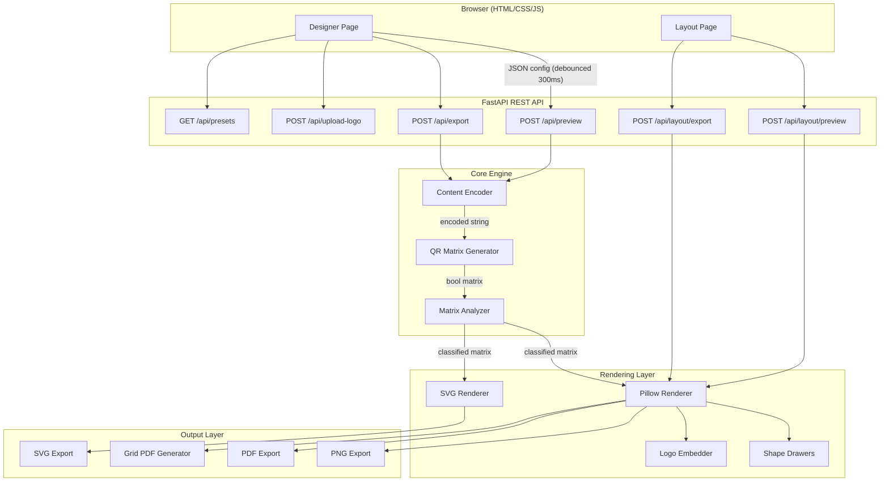

---

## Directory Structure

```
qr_designer/                     # Project root
├── run.py                        # Entry point: starts uvicorn server
├── config.py                     # Global constants (sizes, DPI, paths)
├── requirements.txt              # Python dependencies
├── README.md                     # Quick-start guide
├── docs/                         # Documentation (this file)
│   └── ARCHITECTURE.md
├── uploads/                      # Runtime: uploaded logo images (gitignored)
└── qr_designer/                  # Main Python package
    ├── __init__.py
    ├── core/                     # QR data generation
    │   ├── encoder.py            # Content type encoders (URL, WiFi, vCard...)
    │   ├── generator.py          # qrcode lib wrapper -> boolean matrix
    │   └── matrix_analyzer.py    # Classifies each module by structural role
    ├── styles/                   # Style configuration
    │   ├── color.py              # ColorSpec, GradientSpec, BackgroundSpec
    │   ├── config.py             # QRStyleConfig, LogoConfig (Pydantic)
    │   └── presets.py            # Built-in style presets
    ├── renderer/                 # Image rendering
    │   ├── base.py               # Abstract BaseRenderer
    │   ├── pillow_renderer.py    # Raster renderer (PNG via Pillow)
    │   ├── svg_renderer.py       # Vector renderer (SVG via xml.etree)
    │   └── shapes/               # Shape-drawing primitives
    │       ├── modules.py        # Data module drawers (6 shapes)
    │       ├── finders.py        # 7x7 finder pattern compositor
    │       └── alignment.py      # 5x5 alignment pattern compositor
    ├── logo/                     # Logo embedding
    │   └── embedder.py           # Logo compositing with frames, shadows, text
    ├── export/                   # File format export
    │   └── exporter.py           # PNG/SVG/PDF byte-stream generators
    ├── layout/                   # Print layout
    │   ├── page.py               # Page size definitions (A4, Letter, etc.)
    │   ├── grid.py               # GridConfig (Pydantic)
    │   └── pdf_generator.py      # ReportLab PDF grid builder
    └── web/                      # FastAPI web application
        ├── app.py                # App factory, static/template mount
        ├── models.py             # API request/response Pydantic models
        ├── routes/
        │   ├── api.py            # All REST endpoints
        │   ├── designer.py       # GET / -> designer page
        │   └── layout.py         # GET /layout -> layout page
        ├── static/
        │   ├── css/main.css      # Dark-themed UI styles
        │   └── js/
        │       ├── designer.js   # Real-time preview logic
        │       └── layout.js     # Grid layout controls
        └── templates/
            ├── base.html         # Shared navbar layout
            ├── designer.html     # QR designer page (7 tabs)
            └── layout.html       # Print layout page
```

---

## Technology Stack

| Layer | Technology | Purpose |
|---|---|---|
| QR Matrix | `qrcode` (python-qrcode 8+) | Generate raw boolean QR matrix |
| Raster Rendering | `Pillow` (PIL) | Draw modules, gradients, compositing |
| Vector Rendering | `xml.etree.ElementTree` | Build SVG documents programmatically |
| PDF Generation | `ReportLab` | Coordinate-based PDF for print layouts |
| Web Framework | `FastAPI` + `uvicorn` | Async HTTP, Pydantic validation, OpenAPI |
| Templating | `Jinja2` | Server-side HTML rendering |
| Data Validation | `Pydantic` v2 | Shared models for API + engine config |
| Frontend | Vanilla HTML/CSS/JS | No framework; fetch API for preview |
| File Uploads | `python-multipart` | Logo image upload handling |

**Reserved for future use** (in `requirements.txt` but not yet imported):
- `cairosvg` -- SVG-to-PNG conversion fallback
- `svgwrite` -- Alternative SVG builder
- `openpyxl` -- Batch CSV/Excel import

---

## Module Reference

### `core/` -- QR Matrix Generation and Content Encoding

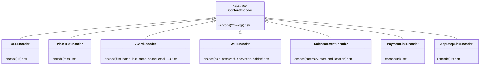

**`encoder.py`** -- Each content type has its own encoder class. The `encode_content(content_type, **kwargs)` function dispatches to the correct encoder via the `ENCODERS` registry dict.

| Content Type | Encoder | Key Parameters |
|---|---|---|
| `url` | `URLEncoder` | `url` (auto-prefixes `https://`) |
| `text` | `PlainTextEncoder` | `text` |
| `vcard` | `VCardEncoder` | `first_name`, `last_name`, `phone`, `email`, `org`, `url`, `address` |
| `wifi` | `WiFiEncoder` | `ssid`, `password`, `encryption` (`WPA`/`WEP`/`nopass`), `hidden` |
| `calendar` | `CalendarEventEncoder` | `summary`, `start`, `end`, `location`, `description` |
| `payment` | `PaymentLinkEncoder` | `url` (bitcoin:, UPI, or https) |
| `deeplink` | `AppDeepLinkEncoder` | `url` (custom URI scheme) |

**`generator.py`** -- Wraps `qrcode.QRCode` to produce a `list[list[bool]]` matrix. Key functions:

- `generate_matrix(data, error_correction, version, box_size, border)` -- The primary generation function. Returns `True` for dark modules.
- `recommend_error_correction(has_logo, style_complexity)` -- Suggests EC level: logo -> H, heavy styling -> Q, light -> M, none -> L.
- `get_qr_version(data, error_correction)` -- Returns the auto-selected QR version number.

**`matrix_analyzer.py`** -- Classifies every module in the matrix by its structural role according to the QR code specification (ISO/IEC 18004):

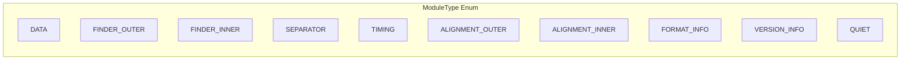

The classification enables the rendering engine to apply **different visual styles to each region** independently. For example, finder outer rings can be circles while data modules are diamonds, each with their own color or gradient.

**How classification works:**

1. Derive QR version from matrix size: `version = (size - 17) / 4`
2. Compute coordinate sets for each structural region using QR spec formulas
3. Priority ordering: `FINDER_INNER` > `FINDER_OUTER` > `SEPARATOR` > `ALIGNMENT_INNER` > `ALIGNMENT_OUTER` > `TIMING` > `FORMAT_INFO` > `VERSION_INFO` > `DATA`

---

### `styles/` -- Style Configuration System

All styling is defined via Pydantic models that serve dual purpose: API request validation and internal rendering configuration.

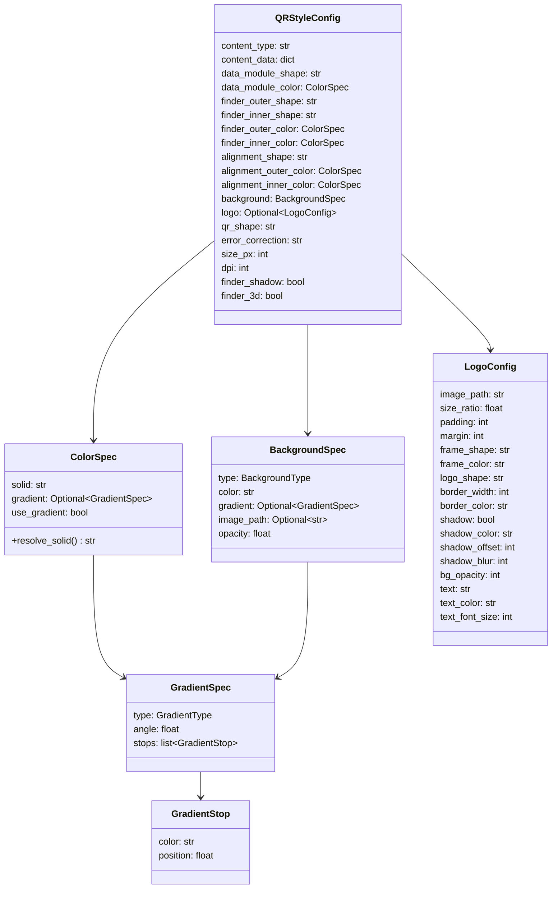

**Available values:**

| Field | Options |
|---|---|
| `data_module_shape` | `square`, `rounded`, `circle`, `diamond`, `hexagon`, `star` |
| `finder_outer_shape` | `square`, `rounded`, `circle`, `diamond` |
| `finder_inner_shape` | `square`, `rounded`, `circle` |
| `alignment_shape` | `square`, `rounded`, `circle` |
| `qr_shape` | `square`, `rounded`, `circle` |
| `error_correction` | `L` (7%), `M` (15%), `Q` (25%), `H` (30%) |
| `BackgroundType` | `solid`, `gradient`, `image`, `transparent` |
| `GradientType` | `linear`, `radial` |
| `logo_shape` | `original`, `circle`, `rounded_square` |
| `frame_shape` | `none`, `circle`, `square`, `rounded` |

**Presets** (`presets.py`): Factory functions that return pre-configured `QRStyleConfig` instances.

| Preset | Description |
|---|---|
| `classic` | Default black-on-white square |
| `rounded_dots` | Circular modules, rounded finder patterns |
| `ocean_gradient` | Blue linear gradient, rounded shapes |
| `sunset` | Red-orange radial gradient, diamond modules |
| `minimal` | Dark gray on light gray |
| `neon` | Green on black, circular everything |

---

### `renderer/` -- Rendering Engines

Two rendering backends share a common abstract interface:

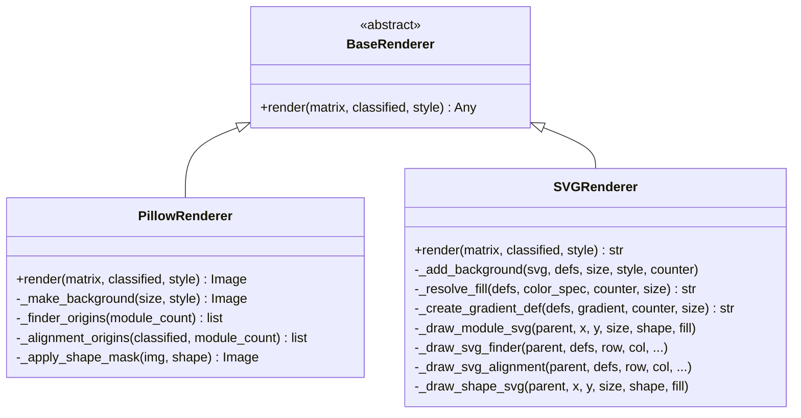

**Rendering order** (both backends follow the same logical sequence):

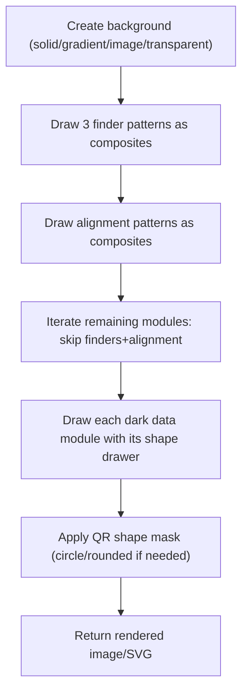

#### Shape Drawers (`renderer/shapes/`)

**`modules.py`** -- Pluggable drawer classes via the Strategy pattern:

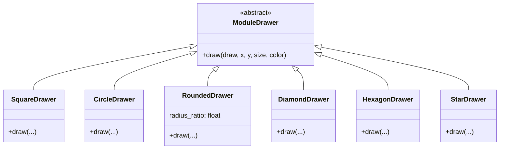

The `DRAWERS` dict maps shape names to singleton instances. `get_drawer(name)` returns `SquareDrawer` as fallback for unknown names.

**`finders.py`** -- Draws a complete 7x7 finder pattern as three nested shapes:
1. Outer ring (7 cells) in `outer_shape` / `outer_color`
2. White gap (5 cells) in background color
3. Inner block (3 cells) in `inner_shape` / `inner_color`

Optional shadow is drawn first as a semi-transparent offset copy.

**`alignment.py`** -- Draws a 5x5 alignment pattern as three nested shapes following the same outer-gap-inner pattern.

---

### `logo/` -- Logo Embedding

The logo embedder composites a user-uploaded image onto the center of a rendered QR code. It supports extensive customization:

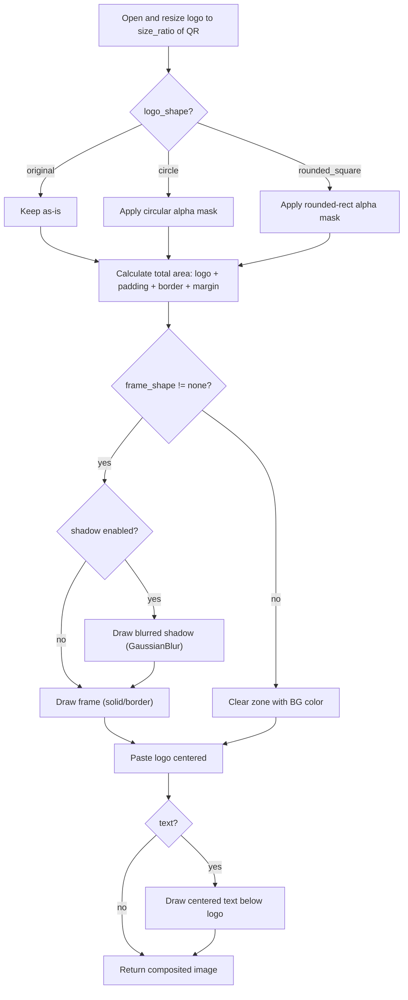

Key parameters in `LogoConfig`:

| Parameter | Description | Range |
|---|---|---|
| `size_ratio` | Logo size relative to QR | 0.05 -- 0.35 |
| `padding` | Space between logo and frame edge | 0 -- 40 px |
| `margin` | Space between frame and QR modules | 0 -- 20 px |
| `frame_shape` | Frame behind logo | `none`, `circle`, `square`, `rounded` |
| `logo_shape` | Crop logo to shape | `original`, `circle`, `rounded_square` |
| `border_width` | Frame border stroke width | 0 -- 10 px |
| `shadow` | Drop shadow behind frame | boolean |
| `shadow_blur` | Gaussian blur radius for shadow | 0 -- 20 |
| `bg_opacity` | Frame background opacity | 0 -- 100% |
| `text` | Label text below logo | string |
| `text_font_size` | Font size for label | 8 -- 32 pt |

---

### `export/` -- File Export

Simple stateless functions that convert rendered output to byte streams:

| Function | Input | Output | Notes |
|---|---|---|---|
| `export_png(image, output, dpi)` | `PIL.Image` | PNG file/stream | Configurable DPI metadata |
| `export_png_bytes(image, dpi)` | `PIL.Image` | `bytes` | In-memory PNG |
| `export_svg(svg_string, output)` | `str` | SVG file/stream | UTF-8 encoded |
| `export_svg_bytes(svg_string)` | `str` | `bytes` | In-memory SVG |
| `export_pdf(image, output, width_mm, height_mm, dpi)` | `PIL.Image` | PDF file/stream | Single-page via ReportLab |
| `export_pdf_bytes(image, ...)` | `PIL.Image` | `bytes` | In-memory PDF |

---

### `layout/` -- Print Grid Layout

Generates print-ready PDF pages with a grid of identical QR codes, designed for sticker sheets.

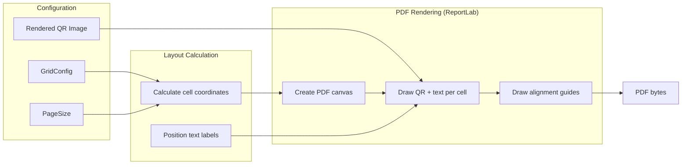

**`page.py`** defines standard page sizes:

| Name | Dimensions (mm) |
|---|---|
| A4 | 210 x 297 |
| A3 | 297 x 420 |
| Letter | 215.9 x 279.4 |
| Legal | 215.9 x 355.6 |

**`grid.py`** (`GridConfig`) controls the grid geometry:
- `rows`, `cols` -- Grid dimensions
- `cell_width_mm`, `cell_height_mm` -- Each cell size
- `h_spacing_mm`, `v_spacing_mm` -- Gutters between cells
- `margin_*_mm` -- Page margins (top, bottom, left, right)
- `offset_x_mm`, `offset_y_mm` -- Fine-tune for sticker sheet alignment
- `top_text`, `bottom_text` -- Labels per cell
- `show_guides`, `show_borders` -- Visual aids for alignment testing

**`pdf_generator.py`** uses ReportLab's `Canvas` with explicit coordinate math. The Y-axis is inverted (PDF origin at bottom-left) so cell positions are calculated as `page_height - margin_top - row * (cell_height + v_spacing)`.

---

### `web/` -- FastAPI Application

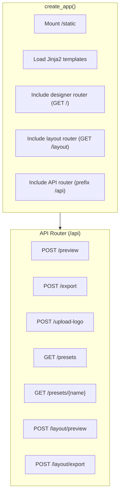

**`app.py`** -- Factory function `create_app()`:
1. Creates `FastAPI` instance
2. Mounts `static/` directory
3. Loads Jinja2 templates
4. Includes three routers: `designer`, `layout`, `api`

**`models.py`** -- API request/response models:

| Model | Used By | Key Fields |
|---|---|---|
| `PreviewRequest` | `POST /api/preview` | `style: QRStyleConfig`, `preview_size: int` |
| `ExportRequest` | `POST /api/export` | `style`, `format` (png/svg/pdf), `width_mm`, `height_mm` |
| `LayoutPreviewRequest` | `POST /api/layout/preview` | `style`, `grid: GridConfig` |
| `LayoutExportRequest` | `POST /api/layout/export` | `style`, `grid` |
| `PresetListItem` | `GET /api/presets` | `name`, `label` |

**`routes/api.py`** -- Contains two internal helper functions:
- `_generate_qr_image(style, size_override)` -- Full pipeline: encode -> generate matrix -> classify -> render -> embed logo. Returns `(Image, matrix, classified)`.
- `_generate_qr_svg(style)` -- Same pipeline but uses SVG renderer, no logo support.

---

## Data Flow

### QR Preview Pipeline

```mermaid
sequenceDiagram
    participant Browser
    participant FastAPI
    participant Encoder
    participant Generator
    participant Analyzer
    participant Renderer
    participant LogoEmbed

    Browser->>FastAPI: POST /api/preview {style, preview_size}
    FastAPI->>FastAPI: Pydantic validates QRStyleConfig
    FastAPI->>Encoder: encode_content(style.content_type, **content_data)
    Encoder-->>FastAPI: encoded string
    FastAPI->>Generator: generate_matrix(data, error_correction)
    Generator-->>FastAPI: bool[][] matrix
    FastAPI->>Analyzer: classify_matrix(matrix)
    Analyzer-->>FastAPI: ModuleType[][] classified
    FastAPI->>Renderer: PillowRenderer.render(matrix, classified, style)
    Renderer-->>FastAPI: PIL Image
    
    alt logo configured
        FastAPI->>LogoEmbed: embed_logo(image, logo_path, ...18 params)
        LogoEmbed-->>FastAPI: composited Image
    end

    FastAPI->>FastAPI: export_png_bytes(image) -> base64
    FastAPI-->>Browser: JSON {image: "data:image/png;base64,..."}
    Browser->>Browser: Set img.src = data URI

    Note over Browser: Debounced at 300ms on every control change
```

### QR Export Pipeline

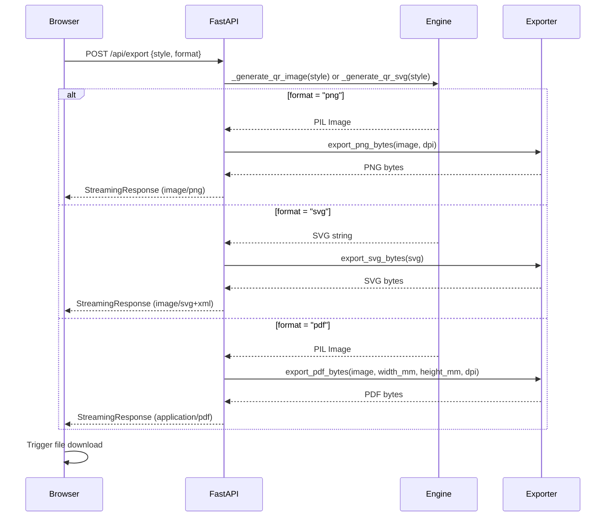

### Print Layout Pipeline

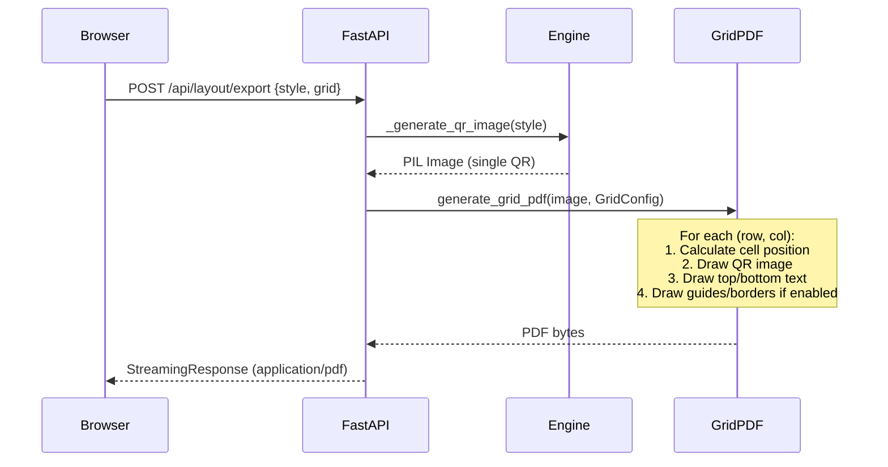

---

## Data Models

### QRStyleConfig

The central configuration model. Every API request carries a `QRStyleConfig` that fully specifies how the QR code should look.

```
QRStyleConfig
├── content_type: str              # "url", "text", "wifi", "vcard", "calendar", "payment", "deeplink"
├── content_data: dict             # Parameters for the chosen encoder
├── data_module_shape: str         # Shape for data modules
├── data_module_color: ColorSpec   # Color/gradient for data modules
├── finder_outer_shape: str        # Shape for finder outer ring
├── finder_inner_shape: str        # Shape for finder inner block
├── finder_outer_color: ColorSpec  # Color for finder outer ring
├── finder_inner_color: ColorSpec  # Color for finder inner block
├── alignment_shape: str           # Shape for alignment patterns
├── alignment_outer_color: ColorSpec
├── alignment_inner_color: ColorSpec
├── background: BackgroundSpec     # BG: solid, gradient, image, transparent
├── logo: Optional[LogoConfig]     # Logo embedding (null = no logo)
├── qr_shape: str                  # Overall QR mask shape
├── error_correction: str          # EC level: L, M, Q, H
├── size_px: int                   # Output pixel size (100-4096)
├── dpi: int                       # Export DPI (72-1200)
├── finder_shadow: bool            # Drop shadow on finders
└── finder_3d: bool                # 3D/emboss effect on finders
```

### ColorSpec and Gradients

```
ColorSpec
├── solid: str               # Hex color "#RRGGBB"
├── use_gradient: bool        # If true, use gradient instead of solid
└── gradient: GradientSpec?
    ├── type: "linear" | "radial"
    ├── angle: float          # Degrees (linear only)
    └── stops: GradientStop[]
        ├── color: str        # Hex color
        └── position: float   # 0.0 to 1.0
```

When `use_gradient` is `true` and `gradient` is provided, the renderer creates a full-size gradient image and samples per-pixel colors for each module. Gradient images are cached by `id(color_spec)` within a single render call.

### LogoConfig

See the [Logo Embedding](#logo---logo-embedding) section for the full parameter table.

### GridConfig

```
GridConfig
├── rows, cols: int           # Grid dimensions
├── cell_width_mm, cell_height_mm: float
├── h_spacing_mm, v_spacing_mm: float
├── margin_top/bottom/left/right_mm: float
├── offset_x_mm, offset_y_mm: float   # Sticker sheet fine-tune
├── top_text, bottom_text: str         # Per-cell labels
├── font_size_pt: float
├── show_guides, show_borders: bool
├── page_size: str                     # "a4", "letter", "a3", "legal"
└── page_width_mm, page_height_mm: float?  # Custom override
```

---

## Rendering Pipeline Deep Dive

### Matrix Classification

Given a 29x29 matrix (version 3, EC-H, content "https://example.com"), the analyzer produces a classification map like this (conceptual):

```
FO FO FO FO FO FO FO SP FM ... FM SP FO FO FO FO FO FO FO
FO FO FO FO FO FO FO SP FM ... FM SP FO FO FO FO FO FO FO
FO FO FI FI FI FO FO SP FM ... FM SP FO FO FI FI FI FO FO
FO FO FI FI FI FO FO SP FM ... FM SP FO FO FI FI FI FO FO
FO FO FI FI FI FO FO SP FM ... FM SP FO FO FI FI FI FO FO
FO FO FO FO FO FO FO SP FM ... FM SP FO FO FO FO FO FO FO
FO FO FO FO FO FO FO SP FM ... FM SP FO FO FO FO FO FO FO
SP SP SP SP SP SP SP SP FM ... FM SP SP SP SP SP SP SP SP
FM FM FM FM FM FM FM FM TM ... TM FM FM FM FM FM FM FM FM
 .  .  .  .  .  . TM  .  D ...  D  .  .  .  .  .  .  .  .
 .  .  .  .  .  .  .  .  . ... AO AO AO AO AO  .  .  .  .
 .  .  .  .  .  .  .  .  . ... AO AI AI AI AO  .  .  .  .
 .  .  .  .  .  .  .  .  . ... AO AI AI AI AO  .  .  .  .
 .  .  .  .  .  .  .  .  . ... AO AI AI AI AO  .  .  .  .
 .  .  .  .  .  .  .  .  . ... AO AO AO AO AO  .  .  .  .
```

Where: FO=FINDER_OUTER, FI=FINDER_INNER, SP=SEPARATOR, FM=FORMAT_INFO, TM=TIMING, AO=ALIGNMENT_OUTER, AI=ALIGNMENT_INNER, D=DATA, `.`=DATA

### Pillow Renderer

The Pillow renderer operates in pixel coordinates. Key implementation details:

1. **Cell size**: `cell_size = size_px // module_count` (integer division ensures modules are exactly aligned)
2. **Gradient caching**: Gradient images are rendered once per `ColorSpec` object and reused for all modules sharing that spec
3. **Finder patterns**: Drawn as composites (not module-by-module) to support rounded/circular outer shapes that span the full 7x7 area
4. **Alignment patterns**: Same composite approach for the 5x5 blocks
5. **Data modules**: Drawn individually using the selected `ModuleDrawer`
6. **Skip logic**: Modules classified as `FINDER_*` or `ALIGNMENT_*` are skipped in the data loop since they were drawn as composites

### SVG Renderer

Produces an SVG XML document string. Uses `xml.etree.ElementTree` for construction. Key differences from Pillow:

- Gradients are defined in `<defs>` and referenced via `url(#id)` fills
- QR shape masking uses `<clipPath>` elements
- Module shapes are SVG primitives (`<rect>`, `<circle>`, `<polygon>`)
- No logo embedding support (logos are composited at the Pillow level only)

### Shape Masking

Non-square QR shapes are applied as a post-processing step:

1. Render the full square QR code
2. Create an alpha mask (`Image.new("L", ...)`) in the desired shape
3. Composite: `result.paste(qr, (0,0), mask)`

This approach ensures all modules are rendered correctly before masking, and the three finder patterns (which must remain visible for scanning) are positioned within the visible area of standard shapes.

---

## API Reference

All endpoints are under the FastAPI app at `http://localhost:8011`. Interactive documentation is auto-generated at `/docs` (Swagger UI) and `/redoc`.

| Method | Path | Request Body | Response | Description |
|---|---|---|---|---|
| `GET` | `/` | -- | HTML | Designer page |
| `GET` | `/layout` | -- | HTML | Print layout page |
| `POST` | `/api/preview` | `PreviewRequest` | JSON `{image: "data:..."}` | Generate preview (base64 PNG) |
| `POST` | `/api/export` | `ExportRequest` | File stream | Download PNG/SVG/PDF |
| `POST` | `/api/upload-logo` | `multipart/form-data` | JSON `{path, filename}` | Upload logo image |
| `GET` | `/api/presets` | -- | JSON `[{name, label}]` | List available presets |
| `GET` | `/api/presets/{name}` | -- | JSON (QRStyleConfig) | Get preset config |
| `POST` | `/api/layout/preview` | `LayoutPreviewRequest` | JSON `{pdf: "data:..."}` | Grid layout preview (base64 PDF) |
| `POST` | `/api/layout/export` | `LayoutExportRequest` | File stream | Download grid PDF |

---

## Web Frontend Architecture

The frontend is vanilla HTML/CSS/JS with no build step.

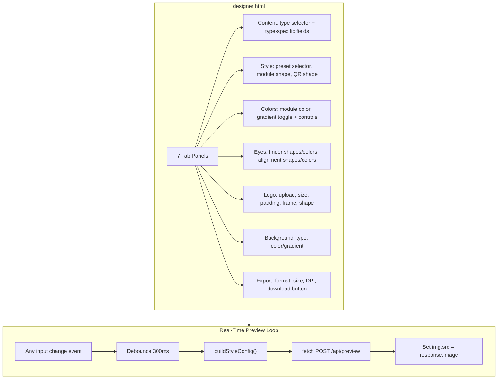

**Key JS functions in `designer.js`:**

| Function | Purpose |
|---|---|
| `buildStyleConfig()` | Reads all form inputs and constructs a `QRStyleConfig` JSON object |
| `getContentData(type)` | Returns content-data dict for the selected content type |
| `buildModuleColor()` | Constructs `ColorSpec` with optional gradient from UI controls |
| `buildBackground()` | Constructs `BackgroundSpec` from background tab controls |
| `generatePreview()` | Sends `POST /api/preview`, updates preview image |
| `exportQR()` | Sends `POST /api/export`, triggers file download |
| `applyPreset(data)` | Populates all form controls from a preset config object |

**`layout.js`** has `buildGridConfig()` and `buildStyleConfig()` for the print layout page.

**CSS**: Dark theme using CSS custom properties (`--bg-primary`, `--accent`, etc.). Responsive grid layout collapses to single-column below 768px.

---

## Extension Guide

### Adding a New Module Shape

1. Create a new class in `qr_designer/renderer/shapes/modules.py` extending `ModuleDrawer`
2. Implement the `draw(draw, x, y, size, color)` method using Pillow drawing primitives
3. Add an entry to the `DRAWERS` dict
4. Add the corresponding SVG drawing logic in `SVGRenderer._draw_module_svg()` in `svg_renderer.py`
5. Add an `<option>` to the module shape `<select>` in `designer.html`

### Adding a New Content Encoder

1. Create a class in `qr_designer/core/encoder.py` extending `ContentEncoder`
2. Implement the `encode(**kwargs)` method returning the string to encode
3. Add to the `ENCODERS` dict
4. Add a content section in `designer.html` with `data-type="your_type"`
5. Add a case in `getContentData()` in `designer.js`
6. Add the `<option>` to the content type `<select>`

### Adding a New Style Preset

1. Create a factory function in `qr_designer/styles/presets.py` that returns a `QRStyleConfig`
2. Add it to the `PRESETS` dict

### Adding a New Finder Pattern Shape

1. Add the shape case in `_draw_shape()` within `qr_designer/renderer/shapes/finders.py`
2. Add the same shape in `SVGRenderer._draw_shape_svg()` in `svg_renderer.py`
3. Add `<option>` entries in the finder shape selects in `designer.html`

### Adding a New Export Format

1. Add an export function in `qr_designer/export/exporter.py`
2. Add a format branch in the `export_qr()` endpoint in `routes/api.py`
3. Add the format `<option>` in the export tab of `designer.html`

### Adding a New Page Size

1. Create a `PageSize` instance in `qr_designer/layout/page.py`
2. Add it to the `PAGE_SIZES` dict
3. Add an `<option>` in the page size select in `layout.html`

---

## Key Design Decisions

### 1. Custom Rendering Pipeline

The `qrcode` library's built-in `StyledPilImage` supports only a few module/eye drawers and does not allow independent per-region styling. Instead, we use `qrcode` **only** for matrix generation and build our own rendering pipeline:

- `MatrixAnalyzer` classifies every module by its QR structural role
- `PillowRenderer` and `SVGRenderer` draw each region type with fully independent style settings

This gives complete control over every visual aspect without fighting library constraints.

### 2. Pydantic Models as Shared Config

`QRStyleConfig` and all sub-models are Pydantic `BaseModel` classes. This means:
- The same model validates incoming API JSON requests
- The same model configures the rendering engine internally
- No translation/mapping layer between API and engine
- Presets are just factory functions returning model instances
- Full JSON serialization for save/load templates

### 3. Composite Pattern Drawing

Finder patterns (7x7) and alignment patterns (5x5) are drawn as composite shapes -- not module-by-module. This enables visually correct rounded/circular outer rings that look like a single continuous shape rather than a grid of rounded squares.

### 4. Stateless Rendering

Every render call is stateless. The renderer receives the full configuration and produces output with no side effects. This makes the API naturally concurrent-safe and simplifies testing.

### 5. Gradient Caching

Pixel-by-pixel gradient generation is expensive. Within a single `render()` call, gradient images are cached by `id(color_spec)` so the same gradient is computed only once even if used for thousands of modules.

### 6. FastAPI over Flask

FastAPI was chosen over Flask for:
- Native Pydantic integration (request validation is automatic)
- Auto-generated OpenAPI documentation at `/docs`
- Native async support for concurrent preview requests
- Built-in WebSocket support for future lower-latency preview
- Better performance for JSON-heavy API workloads
